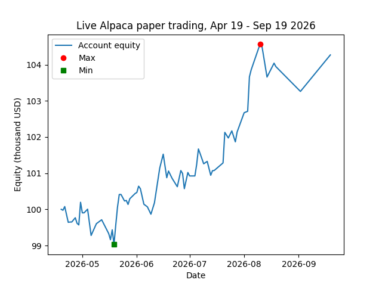
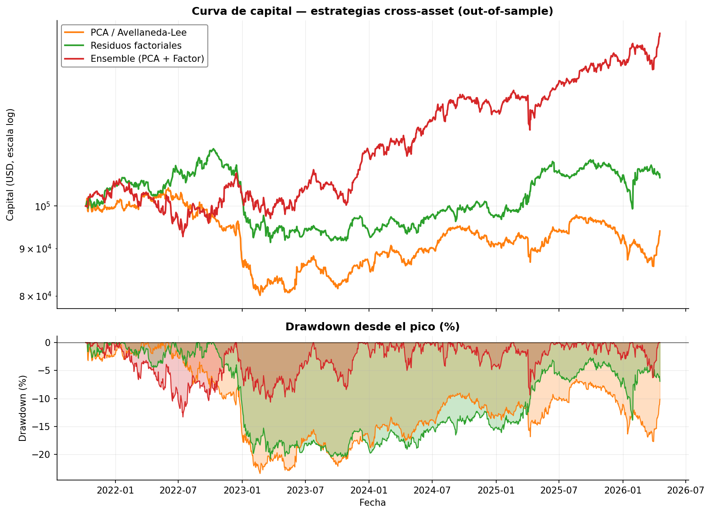
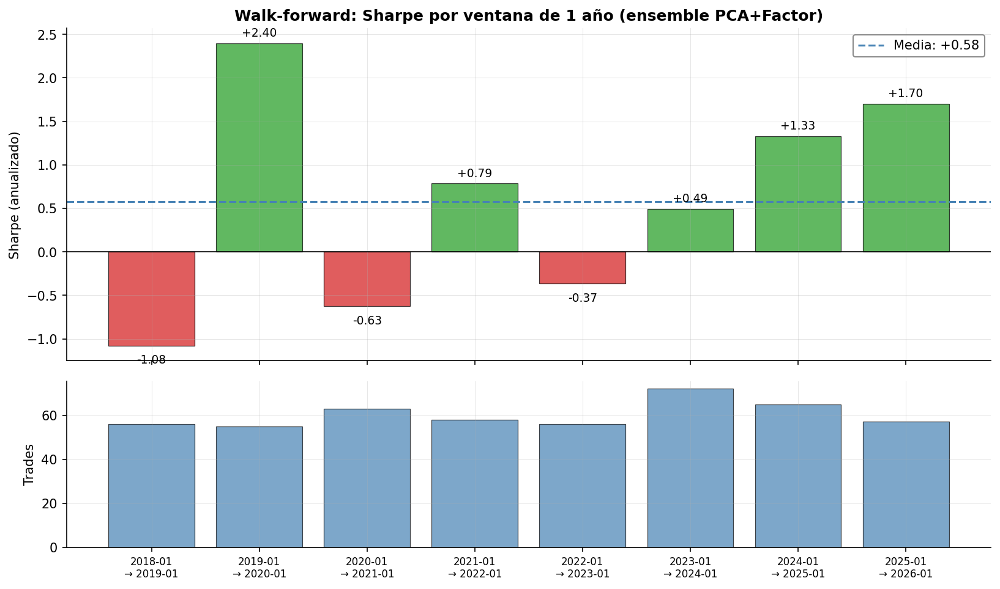

# Cross-Asset Statistical Arbitrage

**Market-neutral mean-reversion across 32 macro ETFs** (equity indexes, sectors, bonds, metals, energy, agriculture, FX). Each asset's return is explained by statistical eigenportfolios and by economic factors; the unexplained residual is modeled as an Ornstein–Uhlenbeck process and traded when it is stretched. The strategy was backtested out-of-sample, stress-tested for robustness, and **has been running live on an Alpaca paper account since April 2026**.



> Applied research project in financial markets (Tec de Monterrey, 2026) by **Santiago Mejía Torres** ([@codemexico](https://github.com/codemexico)) and **Hector Campbell Salas**. Research code, **not investment advice**.

## Results at a glance

| | Value |
|---|---|
| Out-of-sample backtest (Oct 2021 – Apr 2026, 4.5 y, 5 bps costs) | **Sharpe +0.87**, max drawdown −13.3 %, hit rate 54 %, 296 trades |
| Block-bootstrap 90 % CI of the Sharpe (10,000 resamples) | **[+0.06, +1.46]**, P(Sharpe > 0) = 96.3 % |
| Walk-forward, 8 one-year windows (2018–2025) | 5 of 8 positive, mean Sharpe +0.58 (σ = 1.21) |
| Live Alpaca paper trading (Apr 19 – Sep 19 2026) | **+4.27 %** on 100k USD, max drawdown −1.25 % on run snapshots, 143 orders |

Either signal alone is weak (PCA Sharpe −0.15, factor model +0.17). **The ensemble only trades when both agree**, and that consensus is what makes the edge.

## How it works

```mermaid
flowchart LR
    P[Daily prices<br/>32 ETFs] --> A[PCA / Avellaneda–Lee<br/>RMT-denoised eigenportfolios]
    P --> B[7-factor regression<br/>SPY · UUP · TLT · HYG · TIP · USO · GLD]
    A --> RA[Residual ε_i]
    B --> RB[Residual ε_i]
    RA --> OA[OU calibration<br/>z-score]
    RB --> OB[OU calibration<br/>z-score]
    OA --> E{Ensemble<br/>same sign?}
    OB --> E
    E --> T[Long z < −0.30 · Short z > +0.30<br/>close |z| < 0.05 or 20 days]
    T --> X[Alpaca paper account<br/>daily runner]
```

1. **Residuals.** For each asset, the return explained by the model is removed:

```math
\varepsilon_i(t) = R_i(t) - \hat R_i(t)
```

   - **PCA (Avellaneda–Lee):** returns are standardized, the correlation matrix is denoised with random-matrix theory (Marchenko–Pastur), and returns are projected onto the signal eigenportfolios.
   - **Economic factors:** a rolling regression on market, dollar, rates, credit, inflation, oil and gold proxies. An asset that *is* a factor is excluded from its own regressors.
2. **Ornstein–Uhlenbeck.** The cumulative residual $X_i(t)=\sum_{s\le t}\varepsilon_i(s)$ is fitted as an AR(1)/OU process. The signal is $z_i = (X_i - \mu_i)/\sigma_{eq,i}$. Only assets with a half-life between 2 and 60 days are tradable.
3. **Consensus ensemble.** An asset gets a signal only if both frameworks agree in sign. The combined strength uses the mean cross-sectional percentile rank $\bar r$ and the mean absolute z-score:

```math
z_{ens} = 2\,\overline{|z|}\,(\bar r - 0.5)
```

4. **Rules.** Up to 8 positions at 12.5 % each, gross leverage 1×, market orders with DAY time-in-force.

A third framework, pairwise **Engle–Granger cointegration** with Benjamini–Hochberg FDR control over all C(N,2) pairs, is also implemented. On this universe no pair survived the FDR correction, so it was dropped from the ensemble.

## Robustness



| Test | Result |
|---|---|
| Entry-threshold grid (0.2–1.0) × transaction costs | [`04_sensitivity_heatmap.png`](results/backtest/04_sensitivity_heatmap.png) |
| Block bootstrap of the Sharpe | [`05_bootstrap_sharpe.png`](results/backtest/05_bootstrap_sharpe.png) |
| Walk-forward by year | [`06_walk_forward.png`](results/backtest/06_walk_forward.png). The negative years are 2018, 2020 (COVID) and 2022, all extreme regimes |
| Factor exposures | [`07_factor_exposures.png`](results/backtest/07_factor_exposures.png) |



## Position sizing

Four sizing rules were compared against the bot's equal weight, using the same signals, 2017–2026 ([`sizing_comparison.py`](src/sizing_comparison.py)):

| Sizing | CAGR | Sharpe | Max DD | Calmar |
|---|---|---|---|---|
| Equal weight (live bot) | 5.9 % | 0.43 | −34.1 % | 0.17 |
| Signal weight ∝ \|z\| | 4.9 % | 0.37 | −32.5 % | 0.15 |
| Inverse volatility | 2.9 % | 0.33 | −21.3 % | 0.13 |
| \|z\| / σ | 3.3 % | 0.39 | −19.6 % | 0.17 |
| **Vol-targeted (σ_p → 10 %)** | 3.8 % | **0.44** | **−16.1 %** | **0.23** |

Vol targeting keeps the same risk-adjusted return with **half the drawdown**. It is packaged as a drop-in module ([`dynamic_sizing.py`](src/dynamic_sizing.py)) but is not yet wired into the live runner.

## Live paper trading and what broke

`paper_trader.py` runs daily against `paper-api.alpaca.markets`. Version 2 came out of a post-mortem of the first weeks:

- **OPG → DAY orders.** Market-on-open orders expired about 75 % of the time on mid-volume ETFs.
- **Broker is the source of truth.** Local state is reconciled against Alpaca positions at the start of every run, instead of assuming submitted orders were filled.
- **Slot-allocation bug (fixed 25 Jul 2026).** The bot filled all 8 slots with longs before looking at shorts, so it ran **three months long-only**. [`test_decide_actions.py`](src/test_decide_actions.py) reproduces it with the real z-scores from that night and guards against regressions.

## Earlier phases of the project

The strategy was the third phase of a semester-long project. The reports (Spanish) are in [`docs/`](docs):

1. **Technical-indicator backtesting.** Eight strategies on nine large caps, plus options priced with Black–Scholes using GARCH(1,1) volatility forecasts, cross-checked in TradingView and Alpaca ([report](docs/phase1_technical_backtesting_report_ES.pdf), [slides](docs/phase1_technical_backtesting_slides_ES.pdf)).
2. **Risk management and dynamic sizing** ([slides](docs/phase2_position_sizing_ES.pdf)).
3. **Cross-asset stat-arb and paper trading** ([documentation](docs/cross_asset_statarb_documentation_ES.pdf), [results slides](docs/phase3_paper_trading_alpaca_ES.pdf)).

## Run it

```bash
pip install -r requirements.txt
cd src
python run_comparison.py         # the three frameworks side by side
python run_robust_analysis.py    # ensemble, sensitivity, bootstrap, walk-forward -> figs/
python sizing_comparison.py      # sizing rules (needs cache/z_scores.pkl from the step above)
python test_decide_actions.py    # regression tests, no network

# paper trading (needs Alpaca paper keys)
export APCA_API_KEY_ID=...  APCA_API_SECRET_KEY=...
python paper_trader.py --dry-run
```

Prices come from Yahoo Finance via `yfinance`. The first run downloads data and caches z-scores in `src/cache/`.

## Layout

```
src/cross_asset_statarb.py    data, the three mispricing models, OU calibration, backtester
src/run_comparison.py         framework comparison
src/run_robust_analysis.py    robustness suite and figures
src/sizing_comparison.py      sizing study; dynamic_sizing.py = drop-in module
src/paper_trader.py           daily Alpaca runner (v2)
src/plot_paper_equity.py      paper-trading equity figure from the daily snapshots
src/test_decide_actions.py    regression tests for the slot-allocation bug
results/                      backtest figures, walk-forward and sizing tables, paper-trading equity
docs/                         reports and slides (Spanish)
```

## Stack

Python · NumPy · pandas · SciPy · statsmodels · Matplotlib · yfinance · alpaca-py
